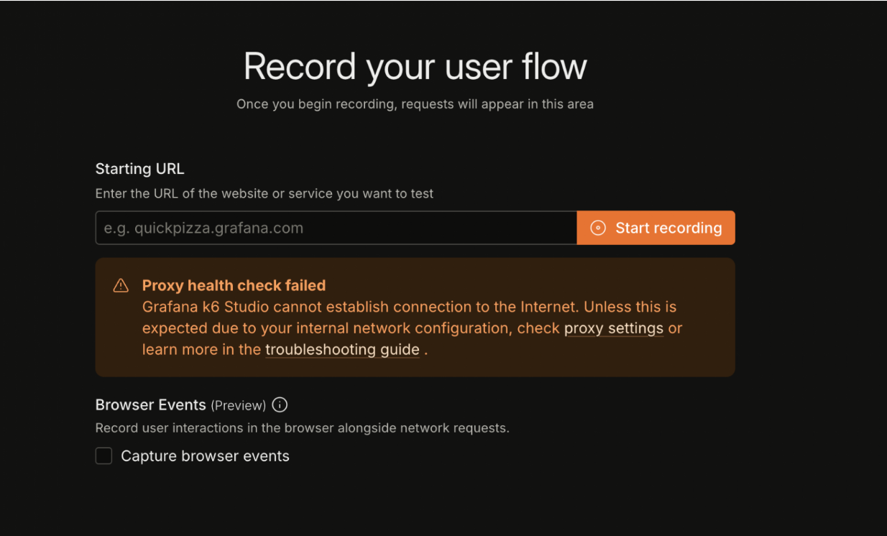
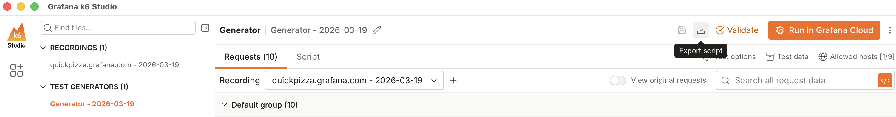

# Introduction to k6 Studio

## Lab Exercise

In this exercise, you'll use k6 Studio to record the QuickPizza login flow and turn it into a runnable k6 script. By the end, you will have:

- Recorded HTTP traffic from a browser session
- Generated a k6 script from that recording
- Adjusted virtual users (VUs) and test duration
- Exported and run the test locally with the k6 CLI

**Need help?** Raise your hand and we'll come assist you!

## Troubleshooting

The first time you launch k6 Studio after installation, you may see a proxy-related error like this:



Fully quit the application and open it again. That usually clears it.

## Lab Exercise Steps

### Step 1: Record the QuickPizza login flow

1. Open the k6 Studio application.
2. On the landing page, click **Record flow**.
3. Enter the URL: `https://quickpizza.grafana.com`
4. **Untick** the **Capture browser events** checkbox as we won't need this for this exercise.

   

5. Click **Start recording**.
6. In the QuickPizza browser window that opens, perform the login flow (use username `default` and password `12345678`).
7. Back in k6 Studio, click **Stop recording** when you're done.

### Step 2: Create a test from the recording

1. Click **Create test > HTTP test** to generate a k6 script from the captured HTTP requests.
2. Select **only** `quickpizza.grafana.com` as the allowed host. This keeps the test focused on our system and excludes third-party hosts.
3. Click **Continue**.

**Tip:** Click **Script** to peek at the generated k6 script before continuing.

### Step 3: Adjust VUs and duration

Click **Test options** and update the number of virtual users (VUs) and/or the test duration.


> [!NOTE]
>
> We don't want very high VU counts or long durations for this workshop (😅) so you can use the following values as a guide:
>
> | Executor    | Target VUs | Duration  | Iterations |
> | ------------| ---------- | --------  | ---------- |
> | Ramping VUs | 5 - 20  | 30s - 3m30s | - |
> | Shared iterations | 5 - 20 | - | 50 - 200 |


### Step 4: Export your test locally

1. Click the **Export script** button.
2. Follow the on-screen instructions to save the script to your machine.



The script is saved under `k6-studio/Scripts/<file-name>`. To open that folder, click the three-dot icon next to your script name and select **Open containing folder**.


### Step 5: Run the test with k6 CLI (optional)

1. Open your terminal.
2. Navigate to the folder containing your exported script:

   ```bash
   cd /path/to/k6-studio/Scripts
   ```

   Replace `/path/to/` with your actual path (e.g. `~/Documents/k6-studio/Scripts`).

3. Run the script:

   ```bash
   k6 run my-script.js
   ```

   Replace `my-script.js` with your actual script filename.

### Step 6: Check the results (optional)

After the test runs, you'll see output similar to the screenshot below.


## Other Resources

Check out the following resources to know more about k6 Studio, how to record browser events, and run a test in Grafana Cloud k6.

- [Documentation: k6 Studio](https://grafana.com/docs/k6/latest/k6-studio/)
- [How to: Record browser events](https://grafana.com/docs/k6/latest/k6-studio/record-browser-events/)
- [How to: Run a test in Grafana Cloud k6](https://grafana.com/docs/k6/latest/k6-studio/run-test-in-grafana-cloud/)