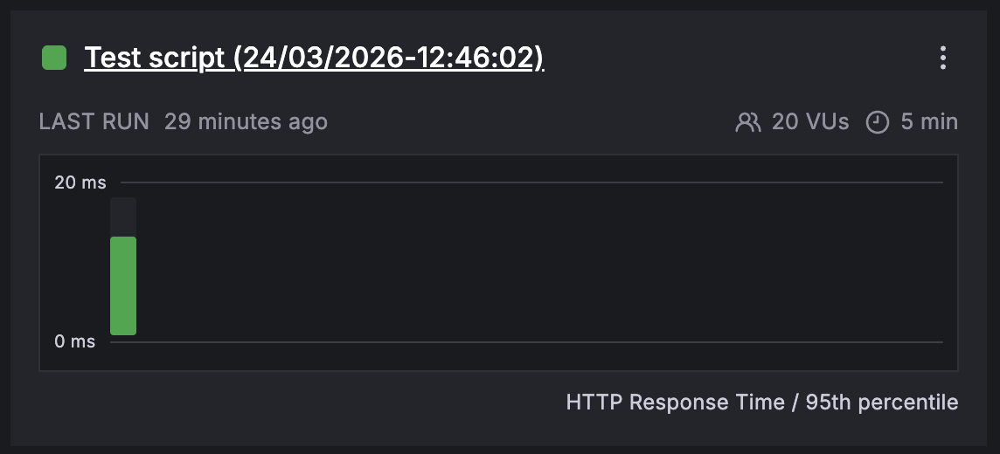
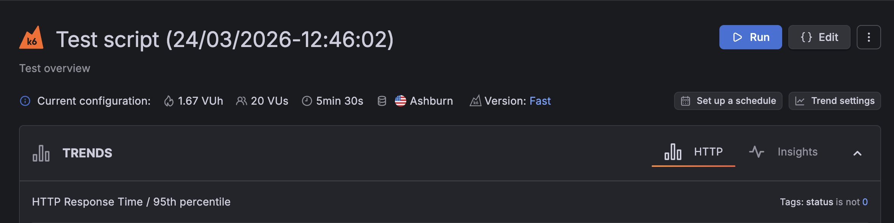
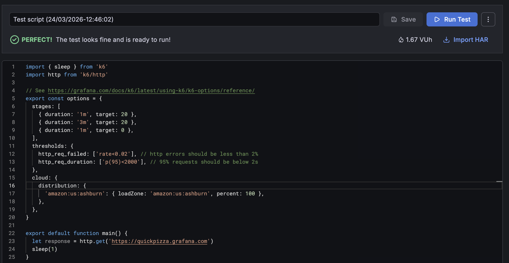

# Introduction to Grafana Cloud k6

## Lab Exercise

In this exercise, you'll get familiar with Grafana Cloud k6. By the end, you will have:

- Authenticated with Grafana Cloud and started a test from your CLI
- Completed the **Understanding test results** tour
- Updated a test to use multiple load zones

**Need help?** Raise your hand and we'll come assist you!

### Step 1: Sign in to your Grafana Cloud instance

Open your Grafana Cloud stack in the browser (for example `https://<your-stack>.grafana.net`) and sign in.

### Step 2: Take the "Run a test from the CLI" tour

1. Open the Grafana menu.
2. Go to **Testing & synthetics > Performance**.
3. Under **Onboarding**, expand **Run a k6 test**, choose **Run a test from the CLI**, then click **Start**.
4. Follow the steps in the tour.

> [!NOTE]
> The **Run a test from the CLI** tour creates a new test in Grafana Cloud. If you prefer to use an existing local test instead, add a `cloud` block to your `options` object:

```js
export const options = {
  // ... your other options (scenarios, thresholds, etc.)
  cloud: {
    projectID: 123456, // replace with your project ID from the tour
    name: 'GrafanaCon 2026 k6 Workshop', // groups runs with the same name
  },
};
```

Replace `123456` with your project ID. You can copy it from step 3 of the **Run a test from the CLI** tour.

### Step 3: Run your test in different load zones

How you add load zones depends on whether you’re editing a script on your machine or a test created in Grafana Cloud.

#### Option A: You’re using a local script (existing test)

1. In your IDE, add a `distribution` object inside `cloud` in your `options`. For example:

   ```js
   export const options = {
     // ... your other options
     cloud: {
       // ... projectID, name, etc.
       distribution: {
         distributionLabel1: { loadZone: 'amazon:us:ashburn', percent: 50 },
         distributionLabel2: { loadZone: 'amazon:ie:dublin', percent: 50 },
       },
     },
   };
   ```

2. Save your file.
3. From your project folder, run the test in Grafana Cloud using the following command:

```bash
# replace `test-file.js` with your actual filename

k6 cloud run test-file.js
```

#### Option B: You’re using a test from the "Run a test from the CLI" tour

1. Open your project in Grafana Cloud, and open the test by clicking its file name.

   

2. Click **Edit**.

   

3. In the editor, within the `cloud` section, set the `distribution` object so traffic is split across load zones. For example:

    ```js
    cloud: {
      // ... projectID, name, etc.
      distribution: {
        distributionLabel1: { loadZone: 'amazon:us:ashburn', percent: 50 },
        distributionLabel2: { loadZone: 'amazon:ie:dublin', percent: 50 },
      },
    }
    ```

4. Click **Run Test** to run the updated test.



#### Load zones reference

You can use more than two zones; keep percentages split evenly and **totaling 100%**.

For the full list of load zones, see [Use load zones](https://grafana.com/docs/grafana-cloud/testing/k6/author-run/use-load-zones/) in the Grafana Cloud k6 documentation.

### (Bonus) Step 4: Take the "Understanding test results" tour

1. Go to **Testing & synthetics > Performance**.
2. Under **Onboarding**, expand **Run a k6 test**, choose **Understanding test results**, then click **Start**.
3. Follow the steps in the tour.

## Other Resources

Check out the following resources to know more about Grafana Cloud k6.

- [Documentation: Grafana Cloud k6](https://grafana.com/docs/grafana-cloud/testing/k6/)
- [How to: Use the test builder](https://grafana.com/docs/grafana-cloud/testing/k6/author-run/test-builder/)
- [Documentation: Set up Private Load Zones](https://grafana.com/docs/grafana-cloud/testing/k6/author-run/private-load-zone/)
- [Documentation: Correlate results in Grafana](https://grafana.com/docs/grafana-cloud/testing/k6/analyze-results/correlate-results-in-grafana/)
- [Webinar: Performance testing and observability in Grafana Cloud](https://grafana.com/go/webinar/performance-testing-and-observability-in-grafana-cloud-2025-emea/)

---

[← Previous exercise](../4.%20intro-to-synthetic-monitoring/) · [Workshop homepage](https://github.com/grafana/grafanacon-2026-k6-workshop) · [Next exercise →](../6.%20intro-to-gc-synthetic-monitoring/)
