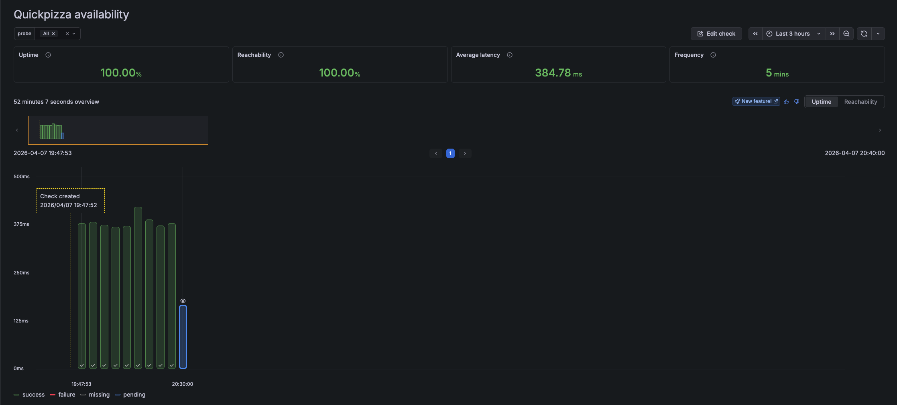
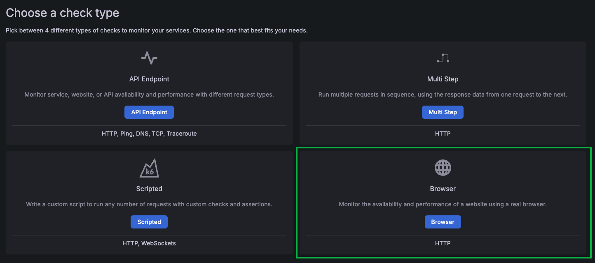

# Introduction to Grafana Cloud Synthetic Monitoring

## Lab Exercise

In this exercise, you'll get familiar with Grafana Cloud Synthetics. By the end, you will have:

- Deployed your first Synthetic Check to Grafana Cloud, verifying that the QuickPizza website is available
- (Bonus): Deployed your first Synthetic Browser Check, verifying that the QuickPizza login works like expected

**Need help?** Raise your hand and we'll come assist you!

## Exercise 1: Create your first Synthetic Monitoring Check

### Step 1: Sign in to your Grafana Cloud instance

Open your Grafana Cloud stack in the browser (for example `https://<your-stack>.grafana.net`) and sign in.

### Step 2: Take the "Create new Scripted Synthetics Check" Pathfinder journey

1. Click the question mark in the top right
2. Scroll down to the "Interactive Guide: Create a new Scripted Synthetic Monitoring Check" 
3. Click **Start** and take the tour.

**Success looks like:** 
The tour leads you to create your first Synthetic Monitoring Check and run it. By the end of the tour, you see check runs automatically being scheduled in the check dashboard like the following screenshot:

## (Bonus) Exercise 2: Create your first Browser Synthetic Monitoring Check

### Step 1: Create a new Browser Check

Follow the same steps you took in the Interactive guide, but this time select the "Browser" check type.

### Step 2: Re-using the QuickPizza Browser login test

In the Check creation step where you need to input a Script, take the QuickPizza login test that you created in the earlier excercise [browser-script.js](../intro-to-browser-testing/answer/browser-script.js).

### Step 3: Complete the Chech creation wizard

Fill out all the details necessary and complete the check.

**Success looks like:** 
Your first Browser Check is now sucessfully created, you see check runs being scheduled automatically in the check dashboard like screenshot in Execise 1.