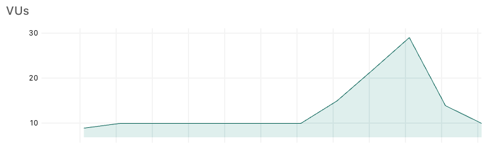
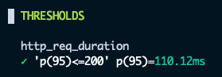

# Introduction to k6 OSS

## Lab Exercise

In this exercise, you'll create a basic k6 script with a pass/fail criteria and a load profile simulating a sudden spike in traffic. By the end, your script will:

- Load the home page of the QuickPizza demo site
- Verify via `thresholds` that Response Time stay within 200ms
- Use `stages` to simulate a sudden spike in traffic

**Need help?** Raise your hand and we'll come assist you!

### Step 1: Create a new test file

Create a new JavaScript file in a folder of your choice. For example, in your terminal:

```bash
touch spike-test.js
```

Then open the file in your IDE.

### Step 2: Add the starter code and complete the test script

Copy the code below into your test file. Your job is to fill in the two steps.

**Reference:** [code-snippets.md](./code-snippets.md) has code examples that will help you in this step.

```js
import { sleep } from "k6"
import http from "k6/http"

export const options = {
  // 1. Define a threshold that verifies http_req_duration staying within 200ms
  
  // 2. Use stages to simulate going from stable load to a 3X spike then back down again
}

export default function main() {
  http.get("https://quickpizza.grafana.com")

  sleep(1)
}
```

### Step 3: Run your test

1. Save your file.
2. In your terminal, run (replace `spike-test.js` with your actual filename):

   ```bash
   K6_WEB_DASHBOARD_EXPORT=test-report.html k6 run spike-test.js
   ```

   **Tip:**
   - Setting `K6_WEB_DASHBOARD=true` visualizes the metrics in a simple web dashboard so you can watch the test live, helpful when modeling the ramping curve.
   
   - Setting `K6_WEB_DASHBOARD_EXPORT=spike-test-report.html` produces a html report of the test result, helpful for analyzing the result. 
   

**Success looks like:**
- The test ramps up to a steady state, suddenly spikes up to 3X load then ramps down again.  
  

- The end of test Console summary prints a section for the defined thresholds.  
  


## Lab Answer

Once you've completed the exercise, you can compare your solution with our sample answer. The reference implementation in [spike-test.js](./answer/spike-test.js) shows one way to define a pass/fail criteria and modelling a spike in load.

