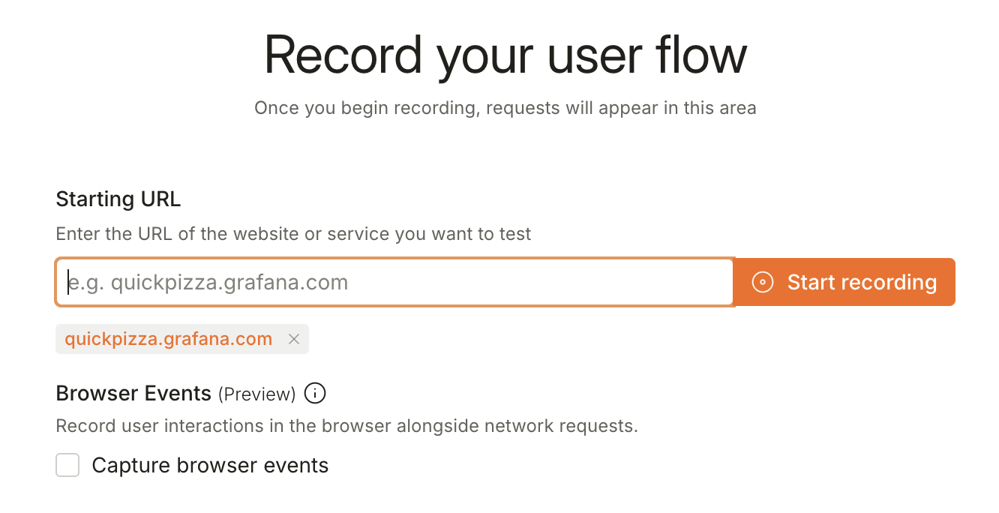
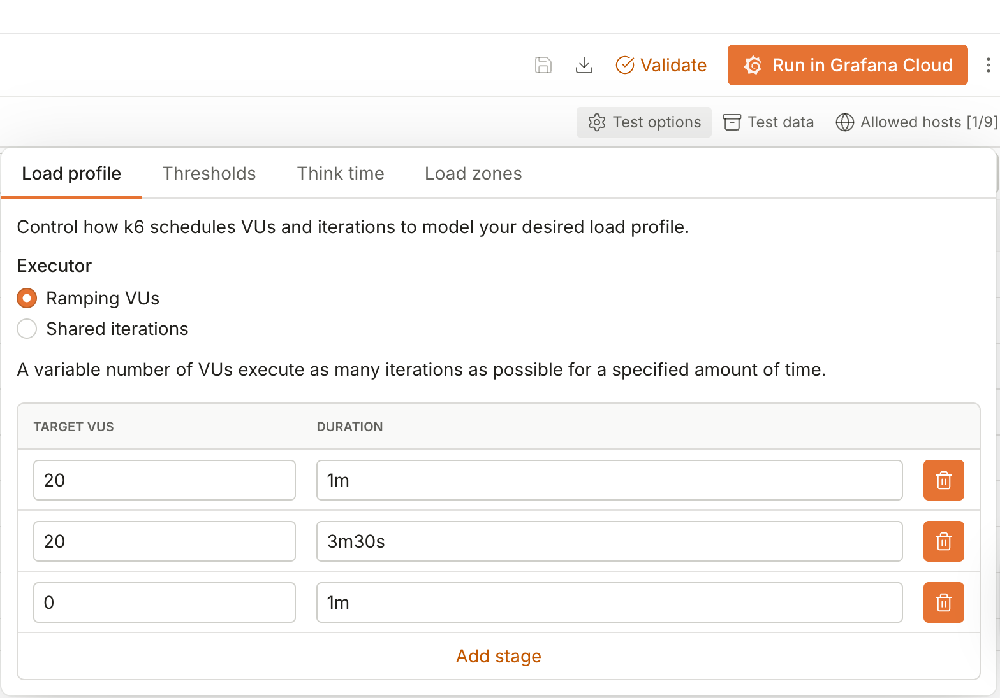
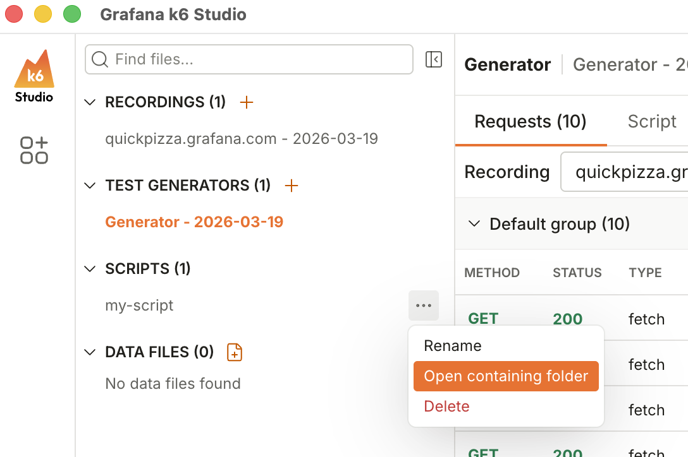
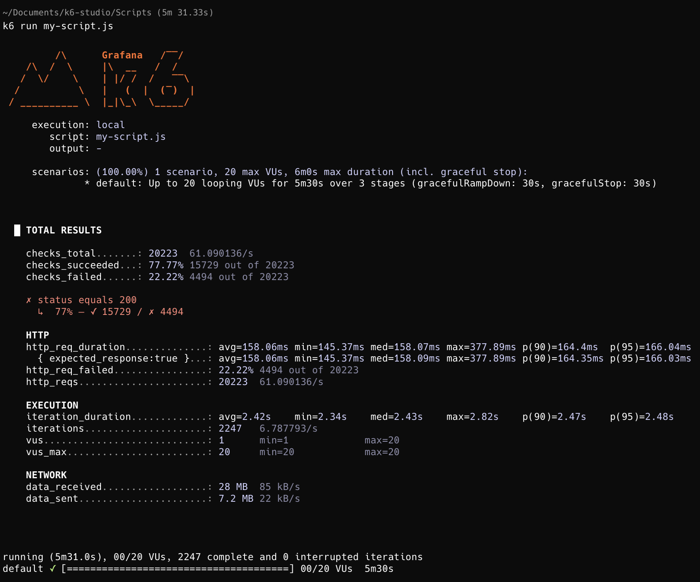

# Introduction to k6 Studio

## Lab Exercise

For this exercise, you are going to record the QuickPizza login flow, update the number of virtual users (VUs) and/or duration, and export the test locally so you can run it with k6 CLI.

If you have any questions, let us know and we'll come and help!

### Record the QuickPizza login flow

1. Open k6 Studio application
2. On the landing page, click **Record flow** button
3. Add the `quickpizza.grafana.com` URL
4. Untick the **Capture browser events** checkbox, as we don't need this feature for this exercise.

    

5. Click **Start recording** button
6. On the QuickPizza app, perform the login flow. 
7. Back at k6 Studio, click **Stop recording** button

### Create test from the recording

1. Click **Create test > HTTP test** to generate a k6 script from the HTTP requests
2. Select `quickpizza.grafana.com` only as the allowed host to include in your test. We only want to test our system, and not any 3rd party hosts.
3. Click **Continue** button

At this point, feel free to click **Script** to see the underlying test script that k6 Studio generated.

### Adjust the number of VUs and/or duration

To update the VUs and/or the duration, click **Test options** and update the values accordingly.

> [!NOTE] 
>
> DON'T go crazy with the numbers! Please use a sensible number of VUs and duration.

### Export your test locally

After you have recorded a test, click the **Export script** button to export your test locally and follow the on-screen instructions.

The exported file will have a relative path of `k6-studio/Scripts/<file-name>`.

To find the entire file path, click the three-dot icon beside your script name, and select **Open containing folder**.

### Run it locally with k6

1. Open your terminal of choice
2. Navigate to your folder containing the k6 Studio script using the `cd` command. For example:

    `cd /Users/mariecruz/Documents/k6-studio/Scripts`

3. Run the script by using the `k6 run` command

    `k6 run my-script.js`

### Observe the results

After running the test, you should see an output similar to the screenshot below.

What do you notice immediately? Let's do a group discussion!